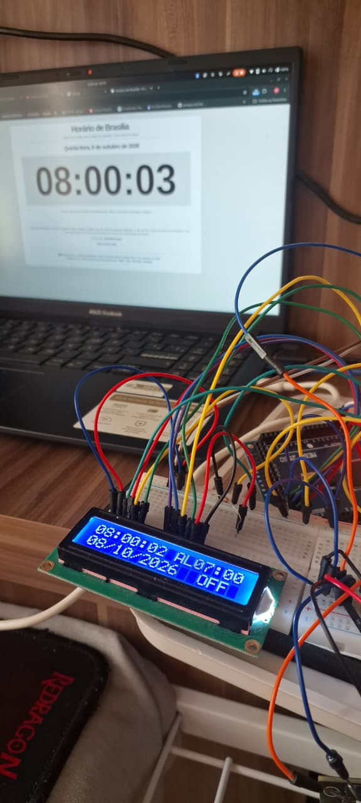
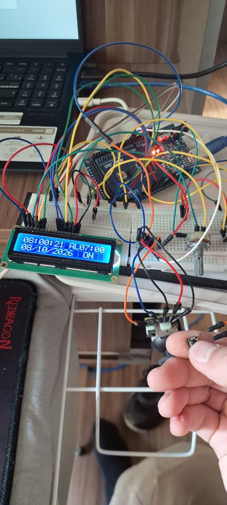
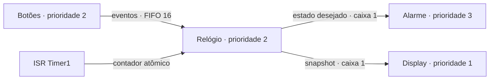
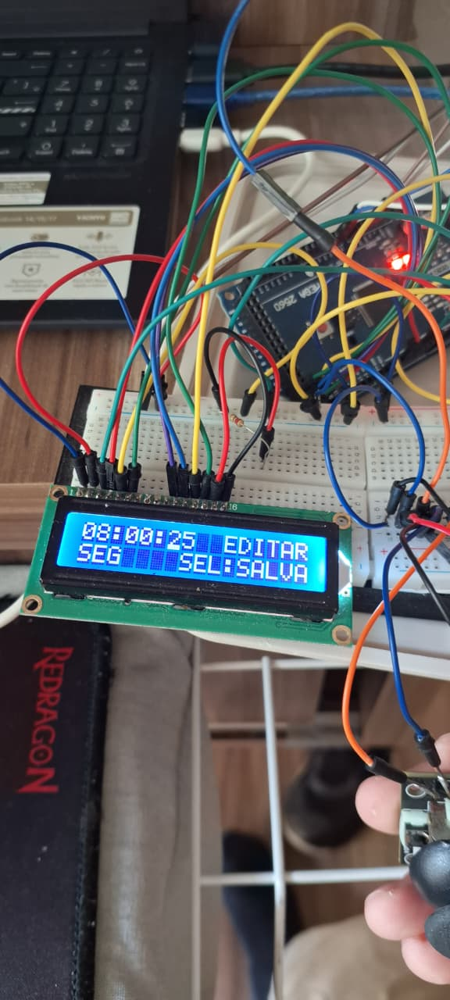
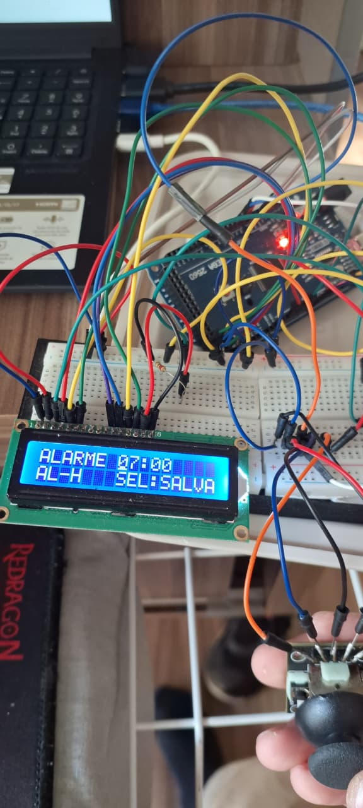
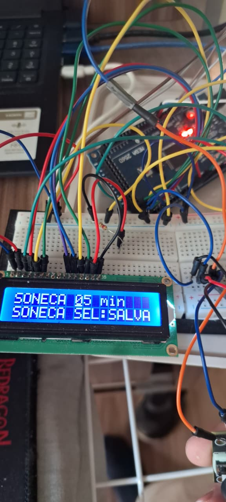

# Relógio e alarme com FreeRTOS

**Pedro Lucas dos Reis Silva — RA 2272040**<br>
Engenharia de Computação — UTFPR Apucarana<br>
Sistemas Embarcados — Exame de Suficiência 2026.2<br>
Professor Adalberto Lazarini — 8 de outubro de 2026

[Relatório em PDF](relatorio/Relatorio.pdf) · [Projeto Overleaf](relatorio/Relatorio_Overleaf.zip) · [Sketch final](firmware/RelogioFinal/RelogioFinal.ino) · [Cabeçalho de tipos](firmware/RelogioFinal/RelogioTipos.h) · [Versões anteriores](versoes/README.md)

[Slides e roteiro para a banca](apresentacao/README.md)

<!-- INICIO_RELATORIO -->
## Introdução

O presente relatório descreve o desenvolvimento de um relógio e alarme para o exame de suficiência de Sistemas Embarcados. O enunciado solicita o uso de Arduino e RTOS, exibição local de data e hora, ajuste por botão ou joystick, configuração de alarme e função soneca. O protótipo utiliza Arduino Mega 2560, LCD 1602A, joystick, botão, buzzer e LED. A operação ocorre pela interface física, com ajuste de data e hora pelo joystick. Durante o funcionamento do protótipo, o computador é utilizado somente para fornecer alimentação. [Enunciado](documentos/Suficiencia_2026_2.pdf)

A solução separa aquisição de entrada, controle do relógio, sinalização e apresentação. Cada tarefa possui uma responsabilidade, e a comunicação ocorre por eventos e cópias de estado em filas. O Timer1 fornece a contagem usada pelo calendário e pelos prazos de alarme; o watchdog mantém o tick do escalonador. Essa separação permite atualizar o LCD e navegar no menu enquanto o relógio continua avançando.

## Protótipo e interface

O LCD opera em modo paralelo de quatro bits. O potenciômetro ajusta exclusivamente o contraste no terminal V0: não há controle de volume no programa. O botão D5 e o clique do joystick utilizam `INPUT_PULLUP`, com acionamento em nível baixo. No Mega, `A0` e `A1` são constantes numéricas equivalentes a 54 e 55. A implementação conserva essa pinagem. A configuração fica em SRAM; após reinicialização, vale o estado inicial definido no sketch.

| Componente | Conexão no Mega | Função |
| --- | --- | --- |
| LCD RS / E | 22 / 23 | Seleção e habilitação |
| LCD D4 / D5 / D6 / D7 | 24 / 25 / 26 / 27 | Dados em quatro bits |
| Joystick X / Y / SEL | 54 (A0) / 55 (A1) / 2 | Navegação e seleção |
| Botão de soneca | 5, botão ao GND | Ação dependente do estado |
| Buzzer / LED | 8 / 9 | Aviso sonoro e visual |
| Potenciômetro de contraste | Cursor ao V0; extremos a 5 V e GND | Legibilidade do LCD |

O clique curto em SEL abre o menu e, ao final, salva o conjunto editado. O movimento horizontal seleciona hora, minuto, segundo, dia, mês, ano, hora do alarme, minuto do alarme ou soneca; o movimento vertical altera o valor. O cursor identifica o campo. O programa mantém um rascunho separado e aplica a edição ao salvar. Assim, alterar apenas o alarme não restaura um horário antigo nem interrompe a contagem corrente.

| Situação | Ação física | Resultado |
| --- | --- | --- |
| Tela normal | Clique SEL | Abre a edição |
| Edição | Esquerda/direita; cima/baixo | Seleciona campo; altera valor |
| Edição | Clique SEL / D5 | Salva / cancela o rascunho |
| Tela normal | D5 | Habilita ou desabilita o alarme |
| Alarme tocando | D5 ou clique SEL | Inicia a mesma soneca configurada |
| Soneca em curso | D5 | Cancela a soneca e desabilita o alarme |
| Qualquer estado | SEL mantido por 1 s | Encerra o aviso e cancela a edição |

A soneca admite de 1 a 10 minutos, com valor inicial de 5 minutos. Cada toque dura até 60 segundos. A repetição da soneca depende de novo acionamento enquanto o alarme toca; não existe repetição automática ilimitada. O encerramento por SEL longo mantém a habilitação diária, enquanto D5 durante a soneca também a desabilita.

<p>


</p>

Registro do autor, 08/10/2026. As nove fotografias originais estão em [fotos/](fotos/).

## FreeRTOS, bare metal e máquina de estados

Em uma implementação bare metal com laço principal, a aplicação determina diretamente a ordem de leitura, cálculo e exibição. Uma chamada demorada pode retardar a próxima leitura, caso o projeto concentre toda a execução no mesmo fluxo. Uma máquina de estados cooperativa, associada a interrupções e temporização sem espera ocupada, também pode executar corretamente este relógio, com menor consumo de memória e menor custo de troca de contexto.

O FreeRTOS acrescenta escalonamento preemptivo, prioridades, filas e estados de execução para cada tarefa. No ATmega2560, existe apenas um núcleo: a concorrência resulta da alternância de contexto, não da execução simultânea de quatro tarefas. Quando a tarefa de alarme fica pronta, sua prioridade permite preemptar a atualização do display. Quando uma tarefa aguarda uma fila ou um prazo do kernel, ela fica bloqueada e libera a CPU.

Máquina de estados e RTOS não são alternativas excludentes. A solução utiliza o RTOS para organizar a concorrência e uma máquina de estados dentro da tarefa de relógio para representar silêncio, toque, soneca e edição. O benefício é separar a política da aplicação da execução dos periféricos. A configuração preemptiva também habilita divisão de tempo entre tarefas prontas de mesma prioridade: relógio e botões compartilham o nível 2. A prioridade define a escolha entre tarefas prontas, não uma reserva fixa de tempo de CPU. O custo adicional envolve pilha por tarefa, memória de filas, troca de contexto e cuidado com sincronização. Portanto, o uso do RTOS atende ao objetivo didático e torna explícita a coordenação de atividades concorrentes; ele não transforma o oscilador em uma referência de horário mais precisa.

## Arquitetura por eventos e diferença entre fila e mutex

A tarefa de relógio possui a única instância autoritativa de `Estado`. A tarefa de botões envia valores do tipo `Evento`; a tarefa de relógio processa cada evento, atualiza o estado e publica a saída. A tarefa de display recebe uma cópia consistente, denominada snapshot. A tarefa de alarme recebe somente a condição desejada de acionamento.



| Canal | Capacidade e conteúdo | Política |
| --- | --- | --- |
| `entradas` | 16 eventos | FIFO; envio sem espera |
| `saidaTela` | 1 snapshot | Substitui a imagem antiga |
| `saidaAlarme` | 1 booleano | Conserva o último estado desejado |

A fila de entrada conserva a ordem dos comandos aceitos. Se estiver cheia, o produtor registra a perda por notificação contadora; a interface apresenta “REPITA O COMANDO”. O envio com tempo zero evita reter a tarefa de entrada, mas não significa capacidade infinita. O controle processa no máximo 16 eventos por passagem, evitando que um fluxo de entrada monopolize indefinidamente o ciclo.

A saída do display tem semântica diferente: importa apresentar o estado mais recente, sem reproduzir uma sequência de telas antigas. A caixa de uma posição permite `xQueueOverwrite`. A mesma política no alarme evita manter um comando de desligamento atrás de comandos desatualizados. O consumidor recebe o estado final vigente; a caixa não representa um histórico de cada transição intermediária.

Na versão com mutex, a tarefa obtém exclusividade para acessar uma estrutura compartilhada e depois devolve o recurso. O mutex não transporta dados e não organiza uma sequência de comandos. No FreeRTOS, o mutex oferece herança de prioridade: quando uma tarefa de alta prioridade espera por ele, o kernel pode elevar temporariamente a prioridade de quem o possui. Isso reduz o efeito da inversão de prioridade, mas não elimina o tempo necessário para liberar o recurso. [Mutexes do FreeRTOS](https://www.freertos.org/Documentation/02-Kernel/02-Kernel-features/02-Queues-mutexes-and-semaphores/04-Mutexes)

| Aspecto | Estado compartilhado com mutex | Estado com dono único e filas |
| --- | --- | --- |
| Acesso | Exige adquirir e liberar exclusividade | O controlador altera seu estado privado |
| Comunicação | Leitura/escrita do objeto comum | Cópia de evento ou snapshot |
| Prioridade | Pode exigir herança de prioridade | LCD não retém um lock necessário ao controle |
| Custo | Pouca cópia, disciplina de bloqueio | Buffer e cópia, política de capacidade |

A implementação final elimina a disputa por um mutex de aplicação entre display, relógio e alarme. Isso remove esse caminho de inversão de prioridade e evita acesso concorrente ao estado civil. A garantia decorre da propriedade do estado e da política de comunicação, não da mera existência de filas. O kernel ainda utiliza proteção interna breve, e a comunicação entre ISR e tarefa exige atomicidade própria.

## Base de tempo, registradores e tick

### Papel de cada temporizador

| Recurso | Base utilizada | Responsabilidade no programa |
| --- | --- | --- |
| Watchdog | Oscilador interno próprio | Tick do FreeRTOS |
| Timer0 | Clock principal dividido por 64 | `millis()` e `micros()` do core Arduino |
| Timer1 | Clock principal dividido por 64 | Contagem do relógio a 100 Hz |
| Timer2 | Configuração interna de `tone()` | Onda sonora do buzzer |

Timer0 não é um RTC de calendário neste projeto. O core utiliza seu overflow de 8 bits, nominalmente a cada 1,024 ms em 16 MHz, e compensa a fração para construir `millis()`. Essa função representa tempo desde a inicialização e aparece no diagnóstico; o calendário utiliza Timer1. Como Timer0 e Timer1 derivam do mesmo clock principal, a concordância entre ambos ajuda a verificar a implementação, mas não comprova exatidão perante uma referência externa. [Core Arduino: wiring.c](https://github.com/arduino/ArduinoCore-avr/blob/master/cores/arduino/wiring.c)

O Timer2 fica reservado à implementação de `tone()` no core AVR utilizado. Não existe conflito direto com Timer1 nesta configuração. A troca de funções dos temporizadores exigiria revisar a biblioteca que utiliza cada periférico. [Core Arduino: Tone.cpp](https://github.com/arduino/ArduinoCore-avr/blob/master/cores/arduino/Tone.cpp)

### Timer1 em CTC

O modo CTC reinicia o contador quando ocorre a comparação com `OCR1A`. Com clock nominal de 16 MHz, prescaler 64 e `OCR1A = 2499`, a frequência de comparação é:

$$f_{comparacao}=\frac{16\,000\,000}{64(2499+1)}=100\;\mathrm{Hz},\qquad T=10\;\mathrm{ms}.$$

| Registrador | Valor configurado | Efeito |
| --- | --- | --- |
| `TCCR1A` | 0 | Saídas de comparação desconectadas |
| `TCCR1B` | `WGM12`, `CS11`, `CS10` | CTC e prescaler 64 |
| `TCNT1` | 0 na inicialização | Inicia a contagem |
| `OCR1A` | 2499 | Define o limite de comparação |
| `TIFR1` | Escreve 1 em `OCF1A` | Limpa uma comparação pendente |
| `TIMSK1` | `OCIE1A` | Habilita a interrupção de comparação A |

A configuração ocorre com interrupções temporariamente mascaradas, antes da execução das tarefas. O contador e a máscara são preparados antes de ligar o clock do periférico. A ISR apenas incrementa uma variável de 32 bits; não escreve no LCD e não executa a lógica do calendário. [Configuração de interrupções megaAVR](https://developerhelp.microchip.com/xwiki/bin/view/products/mcu-mpu/8-bit-avr/peripherals/interrupts/mega-configuration/)

```cpp
volatile uint32_t ticks100Hz = 0;

ISR(TIMER1_COMPA_vect) {
  ++ticks100Hz;
}

uint32_t lerTempo() {
  uint32_t copia;
  ATOMIC_BLOCK(ATOMIC_RESTORESTATE) {
    copia = ticks100Hz;
  }
  return copia;
}
```

O qualificador `volatile` impede que o compilador trate o contador como invariável, mas não torna atômica uma leitura de quatro bytes em um AVR de oito bits. Por isso, `lerTempo()` utiliza `ATOMIC_BLOCK(ATOMIC_RESTORESTATE)`: copia o contador sem interrupção no meio da leitura e restaura a condição anterior de interrupções. O restante do processamento ocorre fora desse bloco. [AVR-LibC: atomicidade](https://avrdudes.github.io/avr-libc/avr-libc-user-manual/group__util__atomic.html)

A diferença sem sinal entre duas amostras recupera as contagens transcorridas, inclusive ao atravessar o rollover do contador. A 100 Hz, um ciclo completo de 32 bits corresponde a aproximadamente 497 dias; a condição é não deixar transcorrer um ciclo completo entre amostras. Atraso de agendamento pode ser compensado a partir das contagens acumuladas. Uma interrupção que o hardware não chegou a registrar não pode ser reconstruída dessa forma; por isso, a aplicação mantém curta a seção atômica e deixa o LCD fora dela.

### Tick do FreeRTOS e periodicidade

A biblioteca instalada é `FreeRTOS 11.1.0-3`. O trecho abaixo provém de `FreeRTOSVariant.h`, linhas 46–48 e 62–63; a marca de omissão apenas separa partes do mesmo arquivo.

```cpp
#ifndef portUSE_WDTO
    #define portUSE_WDTO        WDTO_15MS    // portUSE_WDTO to use the Watchdog Timer for xTaskIncrementTick
#endif
// [...]
#define configTICK_RATE_HZ  ( (TickType_t)( (uint32_t)128000 >> (portUSE_WDTO + 11) ) )  // 2^11 = 2048 WDT scaler for 128kHz Timer
#define portTICK_PERIOD_MS  ( (TickType_t) _BV( portUSE_WDTO + 4 ) )
```

Na configuração `WDTO_15MS`, a expressão inteira de `configTICK_RATE_HZ` resulta em 62 Hz e `portTICK_PERIOD_MS` resulta em 16 ms. Trata-se da configuração nominal do kernel; o período físico do watchdog depende de seu oscilador. A macro oficial de conversão, em `projdefs.h`, linha 42, também utiliza aritmética inteira:

```cpp
#define pdMS_TO_TICKS( xTimeInMs )    ( ( TickType_t ) ( ( ( uint64_t ) ( xTimeInMs ) * ( uint64_t ) configTICK_RATE_HZ ) / ( uint64_t ) 1000U ) )
```

Assim, `pdMS_TO_TICKS(20)` resulta em um tick, `pdMS_TO_TICKS(100)` em seis e `pdMS_TO_TICKS(200)` em doze. O argumento em milissegundos não representa resolução física de 1 ms. A função auxiliar `espera()` garante pelo menos um tick para os períodos solicitados pela aplicação.

A periodicidade do controlador e da leitura de botões utiliza o alias `vTaskDelayUntil`. Na biblioteca, essa chamada corresponde a `xTaskDelayUntil`. O ponto decisivo em `tasks.c` é calcular o próximo despertar a partir da referência anterior, e não do instante em que o trabalho terminou. O trecho seleciona as linhas 2359, 2393 e 2395–2402; o restante da função trata, entre outros pontos, o rollover do tick.

```cpp
xTimeToWake = *pxPreviousWakeTime + xTimeIncrement;
// [...]
*pxPreviousWakeTime = xTimeToWake;
// [...]
if( xShouldDelay != pdFALSE )
{
    traceTASK_DELAY_UNTIL( xTimeToWake );

    /* prvAddCurrentTaskToDelayedList() needs the block time, not
     * the time to wake, so subtract the current tick count. */
    prvAddCurrentTaskToDelayedList( xTimeToWake - xConstTickCount, pdFALSE );
}
```

Essa política evita somar o tempo de execução ao período a cada ciclo. Se a tarefa já perdeu o prazo, a chamada pode retornar sem bloqueá-la naquele ciclo. A precisão do relógio civil, porém, depende das contagens de Timer1: não se acrescenta um segundo apenas porque uma tarefa despertou. [FreeRTOS: xTaskDelayUntil](https://www.freertos.org/Documentation/02-Kernel/04-API-references/02-Task-control/03-xTaskDelayUntil)

## Implementação das quatro tarefas

| Tarefa | Prioridade | Pilha alocada | Ativação |
| --- | --- | --- | --- |
| `tarefaAlarme` | 3 | 256 bytes | Comando ou prazo do padrão sonoro |
| `tarefaRelogio` | 2 | 512 bytes | Ciclo de um tick nominal |
| `tarefaBotoes` | 2 | 288 bytes | Ciclo de um tick nominal |
| `tarefaDisplay` | 1 | 512 bytes | Recepção de snapshot |

### Tarefa de botões

A aquisição faz leitura analógica dos dois eixos e leitura digital dos botões. A faixa central evita interpretar pequenas oscilações como direção. O eixo horizontal tem precedência durante um movimento diagonal. A repetição ocorre a cada 350 ms nominais da base Timer1, permitindo percorrer campos sem gerar comandos a cada leitura.

O debounce exige estabilidade por 50 ms, sem laço de espera pela soltura. SEL diferencia clique curto, emitido ao soltar, e clique longo, emitido uma única vez após um segundo. D5 emite evento na confirmação do aperto. Manter um botão pressionado, portanto, não impede a leitura dos outros controles. A tarefa apenas identifica intenção; a interpretação depende do estado e pertence ao controlador.

### Tarefa de relógio

O controlador avança o calendário pela diferença de contagens e então aplica os eventos recebidos. Antes de cada comando, atualiza novamente o tempo, mantendo coerência entre o instante da ação e os prazos. A função `avancar()` preserva a fração de segundo e percorre as fronteiras de segundo em ordem temporal. O calendário contempla quantidade de dias do mês e ano bissexto, dentro da faixa de edição 2000–2099.

O alarme diário é avaliado no segundo zero do horário configurado. Uma chave de ocorrência identifica data e minuto já tratados, impedindo redisparo da mesma ocorrência. O prazo de toque e o de soneca são relativos, medidos em contagens restantes. Assim, a transição de 23:59:59 para 00:00:00 não invalida uma soneca iniciada no dia anterior. D5 e SEL encaminham o mesmo cálculo de soneca quando o alarme está tocando.

O rascunho mantém a edição independente do estado corrente. Ao salvar uma alteração de hora, minuto ou segundo, o controlador aplica o horário escolhido e reinicia a fração civil. Ao salvar somente alarme ou soneca, conserva o horário que continuou avançando. O snapshot é publicado em intervalos de seis ticks nominais do kernel, suficientes para acompanhar a interação sem obrigar o LCD a reproduzir cada passagem do controlador.

### Tarefa de alarme

A maior prioridade atende à necessidade de iniciar e encerrar prontamente a sinalização. A tarefa permanece bloqueada na fila quando está inativa. Ao receber o estado ativo, alterna buzzer de 2 kHz e LED com espera nominal de doze ticks entre fases. A chamada de recepção permite que um comando interrompa essa espera, inclusive para desligar o aviso.

O Timer2 produz a onda de áudio por interrupção; a tarefa define o padrão de ligar e desligar. A prioridade 3 não significa ocupação contínua da CPU: o bloqueio controlado entre fases deixa o processador disponível. A duração total do toque continua sob responsabilidade da tarefa de relógio, na base Timer1.

### Tarefa de display

A tarefa recebe um snapshot por valor e monta duas linhas com 16 caracteres e terminador. Compara cada linha com a última enviada e atualiza apenas a linha que mudou. Essa estratégia evita limpeza repetitiva da tela e reduz comunicação com o LCD. O acesso ao display durante a operação pertence exclusivamente a essa tarefa; a inicialização utiliza o LCD antes do início do escalonador.

A prioridade 1 permite que controle e alarme preemptem a apresentação. O diagnóstico serial também fica nessa tarefa e não participa dos comandos do usuário. Seu conteúdo inclui contador Timer1, `millis()`, alterações de horário, perdas de eventos, maior intervalo do controlador e margem mínima de pilha observada por tarefa.

## O que a biblioteca executa e como a memória é protegida

A integração Arduino inicia o escalonador após `setup()`. O trecho de `variantHooks.cpp`, linhas 57–58, mostra por que o sketch não chama novamente `vTaskStartScheduler()`:

```cpp
setup();                    // the normal Arduino setup() function is run here.
vTaskStartScheduler();      // initialise and run the freeRTOS scheduler. Execution should never return here.
```

Em `setup()`, a aplicação cria as três filas e as quatro tarefas, verifica cada retorno e inicia Timer1. Durante a operação, não cria nem destrói repetidamente esses recursos. Isso evita crescimento de memória por alocação recorrente no fluxo normal.

A macro de sobrescrita em `queue.h`, linhas 597–598, encaminha o pedido ao mecanismo comum de filas com tempo de espera zero:

```cpp
#define xQueueOverwrite( xQueue, pvItemToQueue ) \
    xQueueGenericSend( ( xQueue ), ( pvItemToQueue ), 0, queueOVERWRITE )
```

A implementação de `prvCopyDataToQueue`, em `queue.c`, linha 2427, evidencia a cópia do conteúdo, e não o armazenamento de um ponteiro para o snapshot local:

```cpp
( void ) memcpy( ( void * ) pxQueue->u.xQueue.pcReadFrom, pvItemToQueue, ( size_t ) pxQueue->uxItemSize );
```

A fila protege internamente essa transferência. Depois do retorno, o produtor pode reutilizar sua variável local, pois o consumidor receberá uma cópia armazenada no canal. O projeto usa estruturas sem ponteiros para dados mutáveis externos; isso é essencial, pois copiar uma estrutura que contém ponteiros não copiaria automaticamente os objetos apontados. [Implementação FreeRTOS: queue.c](https://github.com/feilipu/Arduino_FreeRTOS_Library/blob/master/src/queue.c)

No port AVR, `StackType_t` é `uint8_t`; portanto, a profundidade solicitada corresponde a bytes. A soma das quatro pilhas é 1.568 bytes, além das estruturas internas do kernel, dos buffers de fila e da tarefa ociosa. O diagnóstico com `uxTaskGetStackHighWaterMark()` informa a menor sobra observada desde a criação, permitindo acompanhar a margem durante a navegação e o acionamento do alarme. A configuração instalada também habilita `configCHECK_FOR_STACK_OVERFLOW = 1`. [FreeRTOS: portmacro.h](https://github.com/feilipu/Arduino_FreeRTOS_Library/blob/master/src/portmacro.h)

O termo “sem espera ocupada” descreve o funcionamento normal de entrada, controle e sinalização. Uma tarefa bloqueada pelo kernel aguarda sem executar instruções continuamente; isso é desejável. Não se confunde essa espera com segurar um mutex enquanto escreve no LCD. A ISR e o bloco atômico mantêm proteção mínima, e nenhuma chamada ao LCD fica dentro de uma seção crítica da aplicação.

## Precisão do horário e evolução da solução

A evolução do projeto tratou separadamente comunicação entre tarefas, interface e referência de tempo. A troca de mutex por fila melhora a propriedade do estado e a comunicação; ela, isoladamente, não corrige frequência de oscilador. A troca da referência de contagem do watchdog para Timer1 separa o calendário da periodicidade aproximada do kernel.

| Etapa | Decisão principal | Efeito na solução |
| --- | --- | --- |
| Estado global com mutex | Exclusividade para acesso à estrutura | Primeira organização concorrente |
| Filas e edição conjunta | Eventos e rascunho de configuração | Controle centralizado e navegação por campo |
| Timer1 dedicado | Contagem independente do tick RTOS | Recuperação do tempo registrado entre ciclos |
| Versão final por eventos | Dono único, caixas de saída e prazos relativos | LCD desacoplado e soneca segura na virada do dia |

O repositório preserva também a revisão intermediária com Timer1 livre e prescaler 1024. A versão final documentada utiliza CTC a 100 Hz e `OCR1A = 2499`. Alterar simplesmente para prescaler 1024 e `OCR1A = 15624` produziria 1 Hz nominal, mas exigiria mudar a unidade dos contadores da aplicação. Essa outra divisão do mesmo clock não elimina seu erro físico.

O relógio pode adiantar ou atrasar. O desvio depende da frequência efetiva do oscilador, de temperatura, tolerância e implementação; não existe obrigação de que o erro tenha sempre sinal de atraso. A diferença inicial de sincronização também é distinta da deriva acumulada. Uma fotografia de dois horários permite observar a diferença naquele instante, mas não determina a taxa de deriva.

Para separar esses efeitos, considera-se o erro de indicação `e(t)` e sua variação em um intervalo de referência. Define-se o erro como horário indicado menos horário de referência, com erro e intervalo expressos em segundos:

$$\mathrm{erro\ relativo\ (ppm)}=\frac{e(t_2)-e(t_1)}{t_2-t_1}\,10^6.$$

A contagem em Timer1 evita atribuir ao calendário um segundo baseado apenas no watchdog, mas permanece vinculada ao oscilador principal. O ajuste de segundos permite acertar o horário pela interface local. O registro fotográfico documenta a aferição para apresentação, uma conferência pontual independente da operação autônoma do relógio.

Uma referência independente pode melhorar a manutenção do horário. A biblioteca `Arduino_RTC_Library` utiliza Timer2 assíncrono com cristal externo de 32,768 kHz, prescaler 128 e overflow de 256 contagens: nominalmente, `32768 / 128 / 256 = 1 Hz`. Essa solução requer o cristal e a ligação apropriada ao microcontrolador; instalar a biblioteca não acrescenta esse hardware à placa. Neste protótipo, também seria necessário transferir a geração de áudio para outra solução, pois `tone()` ocupa Timer2. [Arduino RTC: timer2.c](https://github.com/feilipu/Arduino_RTC_Library/blob/master/src/timer2.c)

Timer2 assíncrono não é a única alternativa nem garante erro nulo. Um RTC externo com oscilador apropriado, compensação térmica ou sincronização periódica com uma referência também pode atender a uma exigência maior de exatidão. O projeto apresentado mantém a montagem atual e explicita a diferença entre temporização determinística do software e exatidão da referência física.

## Resultado e conclusão

O registro fotográfico apresenta o protótipo com data e hora no LCD, indicação de alarme habilitado, edição de segundos, configuração de horário do alarme e ajuste da soneca. O requisito de operação local é atendido pelo joystick e por D5; o programa não depende do monitor serial para configurar ou operar o relógio.

<p>



</p>

Registro do autor, 08/10/2026. As nove fotografias originais estão em [fotos/](fotos/).

A compilação final para Arduino Mega 2560, com Arduino AVR 1.8.8, FreeRTOS 11.1.0-3 e LiquidCrystal 1.0.7, utiliza 18.388 bytes de programa e 729 bytes de dados globais e estáticos. O segundo valor antecede a alocação dinâmica de tarefas e filas; não representa o consumo total de SRAM em execução. O ensaio automatizado do núcleo extraído do próprio sketch aprova 13 grupos de verificações, incluindo calendário, soneca na meia-noite, recuperação de intervalos, edição de segundos, debounce, rollover e limites das linhas do LCD. O teste de seis horas utiliza contagens nominais para verificar a aritmética do calendário.

A solução atende à proposta de alarme com RTOS por meio de quatro tarefas com responsabilidades definidas, interface local e sinalização visual e sonora. O estado com dono único elimina o compartilhamento desnecessário do calendário; a fila expressa a intenção do usuário e a caixa de uma posição transporta o estado atual dos periféricos. O Timer1 separa a evolução do relógio da cadência do escalonador, e o prazo relativo preserva a soneca durante a mudança de dia. O resultado integra máquina de estados, interrupções e serviços do FreeRTOS, demonstrando que organização concorrente e precisão física são aspectos complementares do projeto embarcado.
<!-- FIM_RELATORIO -->

## Arquivos da entrega

O firmware final contém somente `RelogioFinal.ino` e `RelogioTipos.h` na mesma pasta. O cabeçalho define os tipos e os leitores de entrada; não exige instalação como biblioteca. As dependências externas são **FreeRTOS 11.1.0-3** e **LiquidCrystal 1.0.7**, disponíveis no Library Manager. O sketch preserva o horário inicial utilizado no último carregamento; o ajuste corrente ocorre pelo joystick.

- `firmware/RelogioFinal/`: código final consolidado.
- `versoes/`: seis etapas anteriores, separadas e identificadas.
- `fotos/`: nove fotografias originais do protótipo em 08/10/2026.
- `relatorio/`: PDF, ZIP importável no Overleaf e fontes LaTeX.
- `referencias/`: excertos do FreeRTOS, procedência e licenças.
- `documentos/`: enunciado do exame.
- `montagem/diagram.json`: montagem para Wokwi; usar com o firmware e as dependências acima.
- `testes/`: verificações do núcleo extraído do sketch final.

```bash
arduino-cli compile --fqbn arduino:avr:mega firmware/RelogioFinal
python3 testes/executar.py
```

O ZIP do relatório abre em `main.tex`, com **pdfLaTeX e Biber**. O código completo fica disponível separadamente, sem apêndice extenso no PDF.
